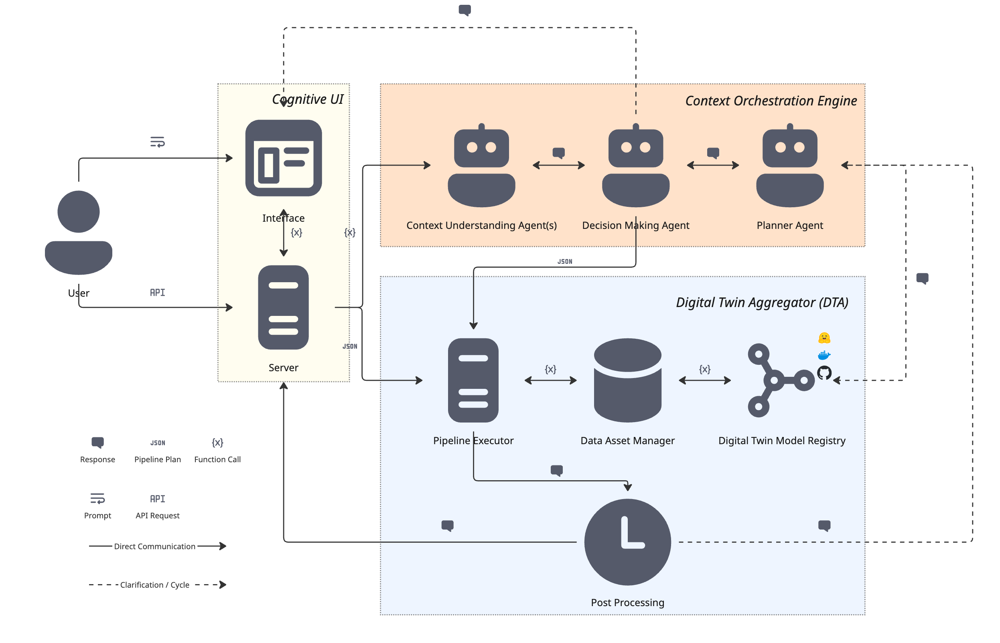

# Summary

DT4LC (Digital Twin for Land Cover) is a Python framework that combines satellite image analysis algorithms, machine learning models, and large language model (LLM) orchestration into a cognitive digital twin for land cover change detection. The framework enables users to perform vegetation analysis, snow and water monitoring, land use classification, and temporal change detection through natural language interaction, without requiring expertise in remote sensing pipelines or programming.

The software provides a three-tier cognitive orchestration engine that translates user intent into executable analysis pipelines: an intent classifier distinguishes analysis requests from conversational queries, a context agent extracts structured goals from natural language, and a hybrid planner selects between template-based and LLM-powered pipeline generation. A declarative component registry allows researchers to extend the system with new algorithms and models by adding YAML configuration entries.

# Statement of Need

Monitoring land cover change from satellite imagery is critical for disaster management, agricultural planning, and environmental governance. Current workflows require researchers to manually select algorithms, configure processing chains, and interpret raw outputs. Cloud platforms such as Google Earth Engine [@gorelick2017google] provide scalable processing but require programming expertise and create cloud dependency. Desktop libraries such as RSGISLib [@bunting2014rsgislib] and Orfeo ToolBox [@grizonnet2017orfeo] offer algorithm implementations but leave pipeline orchestration to the user. Foundation models like Prithvi [@jakubik2023foundation] provide learned geospatial features but require ML engineering to integrate into analysis workflows.

DT4LC addresses this gap by providing an end-to-end framework where analysis pipelines are automatically generated from natural language descriptions of research goals. The target audience includes remote sensing researchers, environmental scientists, and disaster response teams who need to perform land cover analysis without building custom processing pipelines. The conceptual foundations of the dual-timescale digital twin approach are described in [@kussul2026dt4lc_springer], the full framework architecture and disaster-region case studies in [@kussul2025ai], foundation model integration in [@kussul2025idaacs], and the cognitive user interface design in [@chernyatevich2026igarss].

# State of the Field

Existing geospatial analysis tools fall into three categories. Cloud platforms (Google Earth Engine, Microsoft Planetary Computer) provide data access and scalable computation but lock users into specific ecosystems and require API programming. Desktop processing libraries (RSGISLib, Orfeo ToolBox, GDAL) offer algorithm implementations but require manual pipeline construction and provide no intelligent orchestration. AI-focused frameworks (TorchGeo [@stewart2022torchgeo], Prithvi) deliver model inference but require ML engineering expertise for integration.

No existing tool combines spectral index computation, foundation model inference, temporal change detection, and natural language orchestration in a single local-first framework. DT4LC fills this gap by integrating these capabilities through an LLM-powered cognitive layer that abstracts pipeline complexity while remaining extensible through a declarative registry system.

# Software Design

DT4LC follows a modular architecture organized into three layers (\autoref{fig:arch}).

**Context Orchestration Engine (COE).** The cognitive layer processes user requests through four stages: (1) intent classification determines whether the request requires data processing or conversational guidance; (2) context extraction parses natural language into structured goals, desired outputs, and domain keywords; (3) hybrid planning selects between fast template-based matching for common requests and LLM reasoning for complex scenarios; and (4) plan validation checks type compatibility and resource constraints before execution.

**Digital Twin Instance (DTI).** The execution layer dispatches validated plans to algorithm runners (NDVI, EVI, NDWI, NDSI, change detection, LULC classification, snow classification), model runners (Prithvi foundation model, Delineate-Anything field boundary detection), and agent runners (LLM-based result interpretation). Each component declares its inputs and outputs in a YAML registry, enabling type-safe pipeline composition.

**Multi-provider LLM routing.** The framework supports multiple LLM backends (currently including Gemini, Groq, and local Ollama, with additional providers configurable) with automatic fallback strategies (priority-based, cost-aware, or availability-based), ensuring the system operates both with cloud API access and fully offline using local models.

**Interactive map and data management.** The web-based interface includes an interactive map for spatial exploration of analysis results, a data management module for uploading and organizing satellite imagery, and a job tracking system for monitoring pipeline execution.

The component registry enables extensibility without code changes: adding a new algorithm requires implementing a Python `run()` function and registering it in `registry.yaml` with declared inputs, outputs, and keywords.

# Research Impact Statement

DT4LC was developed as part of the DT4LC project (Grant 2023.01/0040) under the Ukrainian-Swiss Joint Research Programme funded by the Swiss National Science Foundation. The framework has been the subject of four peer-reviewed publications spanning the full research lifecycle. The dual-timescale digital twin concept and its positioning relative to existing Earth system DTs (DestinE, NASA ESDT, BioDT) were introduced in [@kussul2026dt4lc_springer]. The complete framework architecture, including modular Digital Twin Instances for vegetation dynamics, land use classification, and climate forecasting, was presented in [@kussul2025ai] with pilot validation on post-flood vegetation recovery monitoring and annual forest dynamics assessment across Ukraine and Switzerland. Foundation model integration strategies, including adaptation of Prithvi and physics-informed neural networks, were evaluated in [@kussul2025idaacs]. The LLM-driven multi-agent cognitive interface --- the distinguishing software contribution of this submission --- was presented in [@chernyatevich2026igarss], demonstrating the system's ability to support both rapid anthropogenic impact assessment and long-term environmental monitoring through conversational interaction. The software is actively used by researchers at the National Technical University of Ukraine "Igor Sikorsky Kyiv Polytechnic Institute" and the University of Geneva.

# AI Usage Disclosure

Large language models (Gemini, Groq-hosted LLaMA, local Ollama) are integral components of the DT4LC software architecture, used at runtime for intent classification, pipeline planning, and result interpretation. During development, Claude (Anthropic) was used for code refactoring and test scaffolding. All AI-assisted outputs were reviewed, edited, and validated by the human authors.

# Acknowledgements

This work was supported by the project "DT4LC -- Developing Scalable Digital Twin Models for Land Cover Change Detection Using Machine Learning" (Grant 2023.01/0040), the Ukrainian-Swiss Joint Research Programme (USJRP) funded by the Swiss National Science Foundation (SNSF), the HORIZON Europe projects SWIFTT (Grant 101082732) and FUTUREFOR (Grant 101180278), and the NASA-funded projects "Assessment of the Impact of War in Ukraine on National Protected Areas" (Grant 80NSSC25K7652) and "Detecting and Mapping War-Induced Damage to Agricultural Fields in Ukraine Using Multi-Modal Remote Sensing Data" (Grant 80NSSC24K0354).

# References
